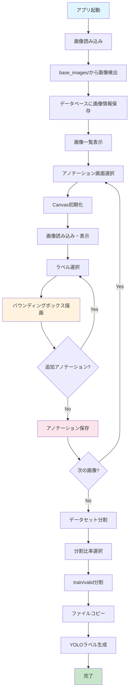
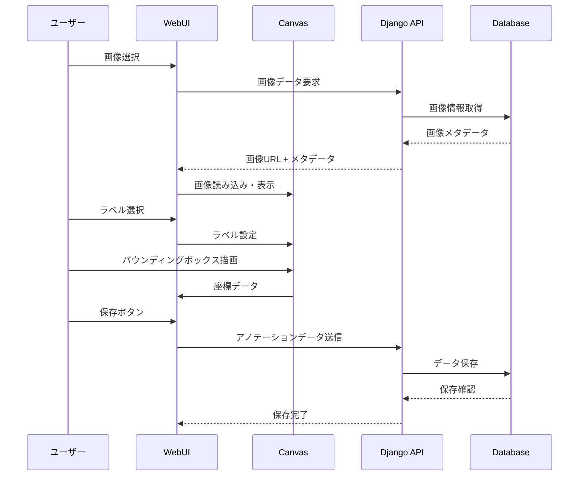
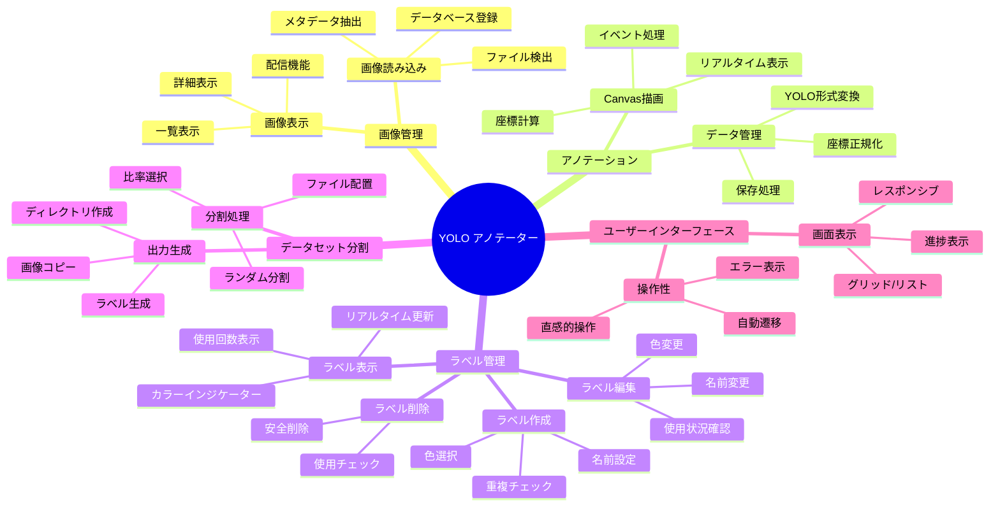
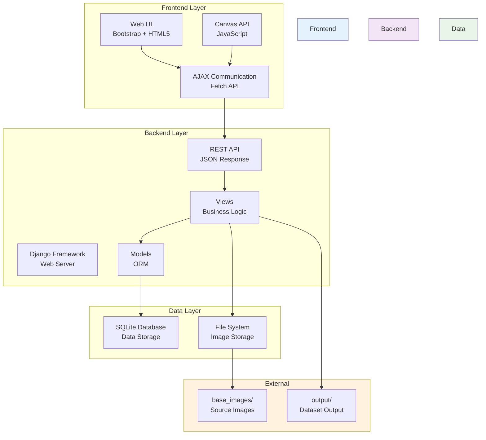
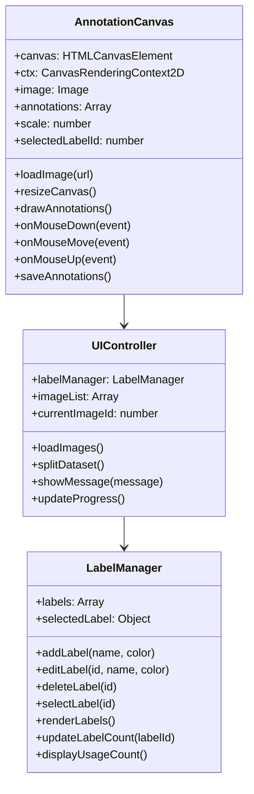
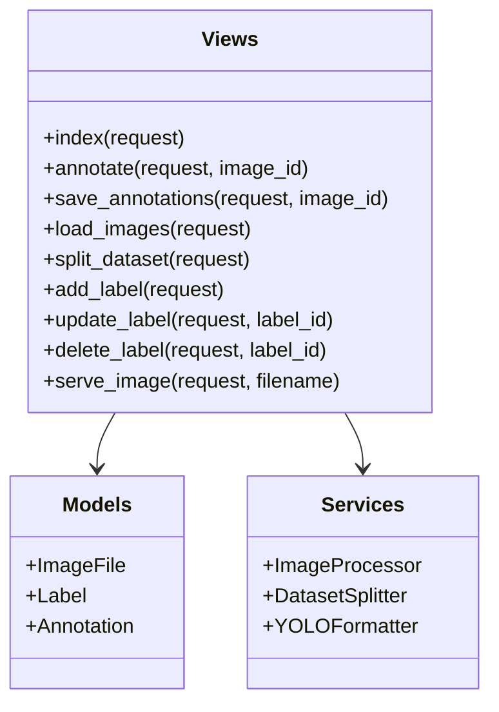
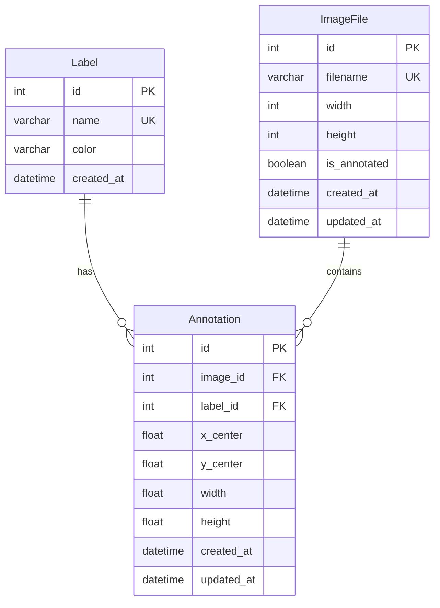

# YOLO アノテーター ドキュメント

## 目的

YOLOアノテーターは、YOLOシリーズ用のバウンディングボックス（矩形アノテーション）を効率的に作成するWebアプリケーションです。物体検出モデルの学習に必要なアノテーションデータを直感的なWebインターフェースで作成し、YOLO形式での出力とデータセット分割を自動化することで、機械学習のワークフローを効率化します。

### 主要目標
- **効率的なアノテーション作業**: ブラウザベースの直感的なUI
- **YOLO形式の正確な出力**: 正規化された座標形式での自動保存
- **データセット管理**: 学習用/検証用データの自動分割
- **ラベル管理**: 動的なラベル追加・編集・削除機能
- **作業効率向上**: 自動保存、順次作業、進捗管理

## 機能

### 🎯 核心機能

#### 1. 画像管理機能
- **自動読み込み**: `base_images/`フォルダからの画像自動検出・登録
- **画像一覧表示**: グリッド/リスト表示の切り替え
- **進捗管理**: アノテーション完了状況の可視化
- **対応形式**: JPG、PNG、BMP、TIFF等の主要画像形式

#### 2. アノテーション機能
- **Canvas API**: HTML5 Canvasを使用した高性能描画
- **バウンディングボックス描画**: ドラッグ操作による直感的な矩形描画
- **リアルタイム表示**: 描画中のプレビュー機能
- **既存アノテーション編集**: 表示・選択・削除機能
- **自動座標変換**: YOLO形式への自動正規化

#### 3. ラベル管理機能
- **動的ラベル作成**: アプリ内でのリアルタイム追加
- **ビジュアルラベル**: 色分けによる視覚的識別
- **ラベル編集**: 名前・色の変更機能
- **使用回数表示**: 各ラベルがアノテーションで使用されている回数をリアルタイム表示
- **安全削除**: 使用中ラベルの削除防止機能
- **管理画面連携**: Django管理画面との統合

#### 4. データセット分割機能
- **比率選択**: 7:3、8:2、9:1の分割比率
- **自動コピー**: 画像とラベルファイルの自動分割配置
- **YOLO形式出力**: 正規化座標での`.txt`ファイル生成
- **ディレクトリ構造**: 標準的な`train/valid`構造の自動生成

#### 5. ユーザーインターフェース
- **レスポンシブデザイン**: モバイル対応のBootstrap UI
- **ナビゲーション機能**: 
  - 前/次ボタンによる双方向移動
  - キーボードショートカット（←/→キー、Ctrl+S）
  - スマートボタン表示（最初/最後の画像で適切な制御）
- **作業効率化**: 高速画像間移動と自動保存
- **進捗表示**: 完了/未完了の明確な表示
- **エラーハンドリング**: 詳細なエラーメッセージとガイダンス

### 🛠️ 技術機能

#### 1. Django Backend
- **RESTful API**: JSON形式でのデータ交換
- **ORM**: 効率的なデータベース操作
- **ファイル管理**: 画像ファイルの安全な配信
- **管理画面**: データベース直接管理機能

#### 2. Database設計
- **SQLite**: 軽量で移植性の高いデータベース
- **正規化設計**: 効率的なデータ構造
- **外部キー制約**: データ整合性の保証
- **インデックス**: 高速検索の実現

#### 3. Frontend技術
- **HTML5 Canvas**: 高性能なグラフィック描画
- **Bootstrap 5**: モダンなレスポンシブUI
- **Vanilla JavaScript**: 軽量で高速な操作
- **AJAX通信**: スムーズなデータ送受信

## フロー図



### 詳細作業フロー

#### アノテーション作業フロー


## 機能分解図



## 詳細設計図

### システムアーキテクチャ



### コンポーネント詳細設計

#### 1. Frontend Components



#### 2. Backend Components



### API設計

#### RESTful Endpoints

| Method | Endpoint | Description | Request | Response |
|--------|----------|-------------|---------|----------|
| GET | `/` | 画像一覧表示 | - | HTML |
| GET | `/annotate/{id}/` | アノテーション画面 | - | HTML |
| POST | `/api/save_annotations/{id}/` | アノテーション保存 | JSON | JSON |
| POST | `/api/load_images/` | 画像読み込み | - | JSON |
| POST | `/api/split_dataset/` | データセット分割 | JSON | JSON |
| POST | `/api/add_label/` | ラベル追加 | JSON | JSON |
| PUT | `/api/labels/{id}/` | ラベル更新 | JSON | JSON |
| DELETE | `/api/delete_label/{id}/` | ラベル削除 | - | JSON |
| GET | `/images/{filename}` | 画像配信 | - | Binary |

#### データ形式

```json
// アノテーション保存リクエスト
{
  "annotations": [
    {
      "label_id": 1,
      "x_center": 0.5,
      "y_center": 0.3,
      "width": 0.2,
      "height": 0.4
    }
  ]
}

// ラベル作成リクエスト
{
  "name": "person",
  "color": "#FF0000"
}

// データセット分割リクエスト
{
  "split_ratio": 0.8
}
```

## Database設計図

### ER図



### テーブル詳細設計

#### 1. Label (ラベル)
| カラム名 | データ型 | 制約 | 説明 |
|----------|----------|------|------|
| id | INTEGER | PRIMARY KEY, AUTO_INCREMENT | ラベルID |
| name | VARCHAR(100) | UNIQUE, NOT NULL | ラベル名 |
| color | VARCHAR(7) | DEFAULT '#FF0000' | 表示色(HEX) |
| created_at | DATETIME | AUTO_NOW_ADD | 作成日時 |

**インデックス**:
- PRIMARY KEY (id)
- UNIQUE INDEX (name)

#### 2. ImageFile (画像ファイル)
| カラム名 | データ型 | 制約 | 説明 |
|----------|----------|------|------|
| id | INTEGER | PRIMARY KEY, AUTO_INCREMENT | 画像ID |
| filename | VARCHAR(255) | UNIQUE, NOT NULL | ファイル名 |
| width | INTEGER | NOT NULL | 画像幅 |
| height | INTEGER | NOT NULL | 画像高さ |
| is_annotated | BOOLEAN | DEFAULT FALSE | アノテーション完了フラグ |
| created_at | DATETIME | AUTO_NOW_ADD | 作成日時 |
| updated_at | DATETIME | AUTO_NOW | 更新日時 |

**インデックス**:
- PRIMARY KEY (id)
- UNIQUE INDEX (filename)
- INDEX (is_annotated)

#### 3. Annotation (アノテーション)
| カラム名 | データ型 | 制約 | 説明 |
|----------|----------|------|------|
| id | INTEGER | PRIMARY KEY, AUTO_INCREMENT | アノテーションID |
| image_id | INTEGER | FOREIGN KEY, NOT NULL | 画像ID |
| label_id | INTEGER | FOREIGN KEY, NOT NULL | ラベルID |
| x_center | FLOAT | NOT NULL | 中心X座標(正規化) |
| y_center | FLOAT | NOT NULL | 中心Y座標(正規化) |
| width | FLOAT | NOT NULL | 幅(正規化) |
| height | FLOAT | NOT NULL | 高さ(正規化) |
| created_at | DATETIME | AUTO_NOW_ADD | 作成日時 |
| updated_at | DATETIME | AUTO_NOW | 更新日時 |

**インデックス**:
- PRIMARY KEY (id)
- FOREIGN KEY (image_id) REFERENCES ImageFile(id)
- FOREIGN KEY (label_id) REFERENCES Label(id)
- INDEX (image_id, label_id)

### データ制約

#### 外部キー制約
```sql
-- ラベル削除時の制約
ALTER TABLE Annotation ADD CONSTRAINT fk_annotation_label
    FOREIGN KEY (label_id) REFERENCES Label(id)
    ON DELETE CASCADE;

-- 画像削除時の制約
ALTER TABLE Annotation ADD CONSTRAINT fk_annotation_image
    FOREIGN KEY (image_id) REFERENCES ImageFile(id)
    ON DELETE CASCADE;
```

#### チェック制約
```sql
-- 座標値の範囲制約
ALTER TABLE Annotation ADD CONSTRAINT chk_coordinates
    CHECK (x_center >= 0 AND x_center <= 1 AND
           y_center >= 0 AND y_center <= 1 AND
           width > 0 AND width <= 1 AND
           height > 0 AND height <= 1);
```

## セキュリティ設計

### 1. データ保護
- **CSRF保護**: Django標準のCSRF保護機能
- **SQLインジェクション対策**: ORMによるクエリパラメータ化
- **ファイルアップロード制限**: 許可された画像形式のみ
- **パス検証**: ディレクトリトラバーサル攻撃対策

### 2. アクセス制御
```python
# 設定例
DEBUG = False  # 本番環境では必須
ALLOWED_HOSTS = ['localhost', '127.0.0.1']
SECRET_KEY = 'production-secret-key'
```

### 3. ファイルセキュリティ
```python
# 画像配信時の安全性チェック
def serve_image(request, filename):
    # ファイル名の検証
    if '..' in filename or '/' in filename:
        raise Http404("Invalid filename")
    
    # ファイル存在確認
    file_path = os.path.join(settings.BASE_IMAGES_DIR, filename)
    if not os.path.exists(file_path):
        raise Http404("File not found")
```

## パフォーマンス設計

### 1. データベース最適化
- **インデックス戦略**: 検索頻度の高いカラムにインデックス設定
- **クエリ最適化**: select_related/prefetch_relatedの活用
- **ページネーション**: 大量データ対応

### 2. フロントエンド最適化
- **Canvas最適化**: 効率的な描画処理
- **画像キャッシュ**: ブラウザキャッシュの活用
- **非同期処理**: AJAX通信によるUX向上

### 3. ファイル処理最適化
```python
# 画像メタデータの効率的な取得
def get_image_dimensions(self):
    try:
        with Image.open(self.file_path) as img:
            return img.size
    except Exception:
        return (0, 0)
```

## 運用設計

### 1. ログ設定
```python
LOGGING = {
    'version': 1,
    'disable_existing_loggers': False,
    'formatters': {
        'verbose': {
            'format': '{levelname} {asctime} {module} {message}',
            'style': '{',
        },
    },
    'handlers': {
        'console': {
            'class': 'logging.StreamHandler',
            'formatter': 'verbose',
        },
        'file': {
            'class': 'logging.FileHandler',
            'filename': 'yolo_annotator.log',
            'formatter': 'verbose',
        },
    },
    'loggers': {
        'annotator': {
            'handlers': ['console', 'file'],
            'level': 'INFO',
        },
    },
}
```

### 2. バックアップ戦略
- **データベースバックアップ**: SQLiteファイルの定期コピー
- **画像ファイルバックアップ**: base_imagesフォルダの同期
- **設定ファイルバックアップ**: settings.pyの保存

### 3. モニタリング
- **エラー監視**: Django管理画面でのエラーログ確認
- **パフォーマンス監視**: データベースクエリ実行時間
- **容量監視**: ディスク使用量の定期確認

## 拡張設計

### 1. 機能拡張ポイント
- **多角形アノテーション**: セグメンテーション対応
- **キーポイントアノテーション**: ポーズ推定対応
- **3Dアノテーション**: 3D物体検出対応
- **マルチユーザー**: 複数ユーザーでの同時作業

### 2. 技術拡張ポイント
- **クラウド対応**: AWS/Azure/GCPでの運用
- **コンテナ化**: Docker対応
- **スケールアウト**: Redis/PostgreSQLでの分散処理
- **API拡張**: OpenAPIスキーマ対応

### 3. インテグレーション
- **ML Pipeline**: モデル学習パイプラインとの連携
- **データ管理**: MLOpsツールとの統合
- **品質管理**: アノテーション品質チェック機能

## トラブルシューティング

### 1. 一般的な問題と解決策

#### 画像表示問題
```bash
# 問題: 画像が表示されない
# 解決策:
1. base_images/フォルダの存在確認
2. 画像形式の確認（JPG, PNG, BMPなど）
3. ファイル権限の確認
4. Django設定の確認
```

#### データベース問題
```bash
# 問題: マイグレーションエラー
# 解決策:
cd yolo_annotator
uv run python manage.py makemigrations
uv run python manage.py migrate
```

#### JavaScript エラー
```javascript
// 問題: Canvas描画エラー
// 解決策: ブラウザ開発者ツールでエラー確認
console.log('Canvas element:', document.getElementById('annotation-canvas'));
```

### 2. パフォーマンス問題

#### 大量画像処理
```python
# バッチ処理での画像読み込み
def load_images_batch(batch_size=100):
    for i in range(0, len(image_files), batch_size):
        batch = image_files[i:i+batch_size]
        # 処理
```

#### メモリ使用量最適化
```python
# 画像メタデータのみ取得
def get_image_info_only(filepath):
    with Image.open(filepath) as img:
        return img.size  # 画像データはメモリに保持しない
```

## 開発・運用ガイドライン

### 1. 開発環境セットアップ
```bash
# 依存関係インストール
uv sync

# データベース初期化
cd yolo_annotator
uv run python manage.py migrate
uv run python manage.py createsuperuser
uv run python manage.py init_labels

# 開発サーバー起動
uv run python main.py
```

### 2. テスト戦略
```python
# モデルテスト例
class AnnotationModelTest(TestCase):
    def test_yolo_format_conversion(self):
        annotation = Annotation(
            label_id=1, x_center=0.5, y_center=0.3,
            width=0.2, height=0.4
        )
        expected = "1 0.5 0.3 0.2 0.4"
        self.assertEqual(annotation.to_yolo_format(), expected)
```

### 3. デプロイメント
```bash
# 本番環境用設定
export DJANGO_SETTINGS_MODULE=yolo_annotator.settings_production
export DEBUG=False
export SECRET_KEY=your-production-secret-key

# 静的ファイル収集
uv run python manage.py collectstatic --noinput

# 本番サーバー起動
gunicorn yolo_annotator.wsgi:application
```

## 結論

YOLO アノテーターは、効率的な物体検出用アノテーション作業を実現するWebアプリケーションです。Django・JavaScript・HTML5 Canvasを組み合わせた堅牢なアーキテクチャにより、スケーラブルで保守性の高いシステムを提供します。

本ドキュメントで示した設計により、以下の価値を提供します：

- **開発効率**: 直感的なUI による作業時間短縮
- **品質保証**: 正確なYOLO形式出力とデータ整合性
- **拡張性**: モジュール化された設計による機能追加容易性
- **運用性**: 堅牢なエラーハンドリングと監視機能

今後の拡張により、より多様なアノテーション需要に対応し、機械学習ワークフロー全体の効率化に貢献することが期待されます。

## 新機能：ナビゲーション機能

### 概要
アノテーション作業の効率を向上させるため、画像間の前後移動機能を実装しました。

### 機能詳細

#### 1. ナビゲーションボタン
- **前ボタン**: 前の画像IDに移動
- **次ボタン**: 次の画像IDに移動
- **スマート表示**: 最初/最後の画像では適切なボタンのみ表示

#### 2. キーボードショートカット
- **←キー**: 前の画像への移動
- **→キー**: 次の画像への移動
- **Ctrl+S**: アノテーション保存
- **干渉防止**: モーダルや入力フィールド使用時は無効化

#### 3. 実装詳細

##### Backend（views.py）
```python
def annotate(request, image_id):
    # 次の画像と前の画像を取得
    next_image = ImageFile.objects.filter(id__gt=image_id).first()
    prev_image = ImageFile.objects.filter(id__lt=image_id).order_by('-id').first()
    
    return render(request, 'annotator/annotate.html', {
        'next_image': next_image,
        'prev_image': prev_image
    })
```

##### Frontend（annotate.html）
- Bootstrap btn-groupでナビゲーションボタンを配置
- 条件分岐でボタン表示制御
- アイコン付きで視覚的にわかりやすい設計

##### JavaScript（annotator.js）
- キーボードイベントリスナーの追加
- モーダル使用時の干渉防止機能
- エラーハンドリングとデバッグ機能

#### 4. ユーザー体験の向上
- **マウス操作**: ボタンクリックで直感的移動
- **キーボード操作**: 高速な連続作業が可能
- **作業継続性**: 前の画像に戻って修正作業が可能
- **効率性**: Ctrl+Sでの素早い保存
