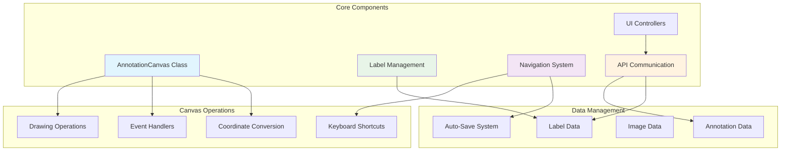
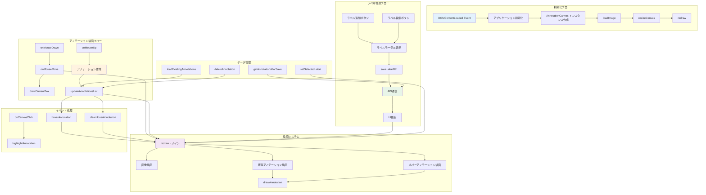
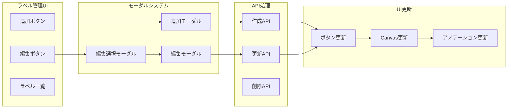
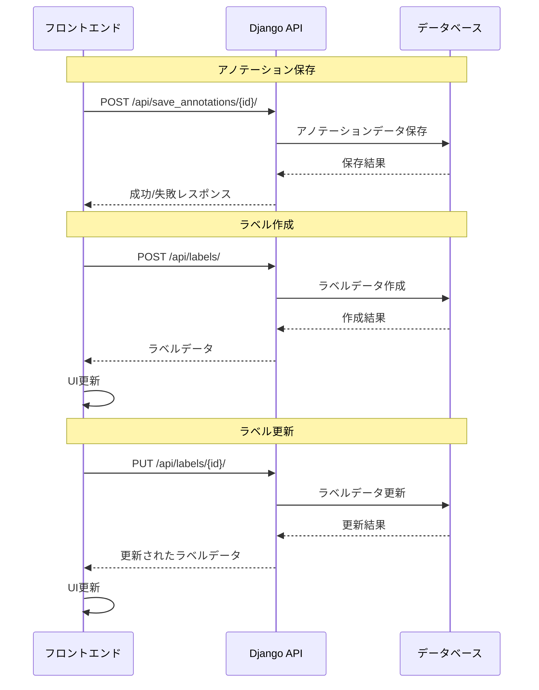

# annotator.js 詳細解説ドキュメント

## 概要

`annotator.js`は、YOLO形式のアノテーション作業を行うためのWebアプリケーションのフロントエンド中核ファイルです。HTML5 Canvas APIを使用してバウンディングボックスの描画、ラベル管理、アノテーションデータの保存、効率的ナビゲーション機能などを提供します。

## アーキテクチャ概要



## 主要機能

### 1. AnnotationCanvas クラス
YOLO アノテーション機能の中核を担うクラスです。Canvas APIを使用してバウンディングボックスの描画とYOLO形式での座標管理を行います。

### 2. 効率的ナビゲーション機能
- **双方向移動**: 前/次ボタンによる画像間移動
- **キーボードショートカット**: ←/→キー、Ctrl+S
- **自動保存**: 画像移動時の自動保存機能
- **スマートUI**: 適切なボタン表示制御

### 3. 動的ラベル管理
- **リアルタイム追加**: その場でのラベル作成
- **視覚的識別**: 色分けによる区別
- **安全な削除**: 使用中ラベルの削除防止
- **統合管理**: アノテーション画面での一元管理

#### プロパティ

| プロパティ名 | 型 | 説明 |
|-------------|-----|------|
| `canvas` | HTMLCanvasElement | HTML Canvas要素 |
| `ctx` | CanvasRenderingContext2D | 2Dレンダリングコンテキスト |
| `image` | Image | 描画対象の画像オブジェクト |
| `annotations` | Array | アノテーションデータ配列 |
| `currentAnnotation` | Object/null | 現在描画中のアノテーション |
| `selectedLabelId` | number/null | 選択中のラベルID |
| `selectedLabelName` | string/null | 選択中のラベル名 |
| `selectedLabelColor` | string | 選択中のラベル色 |
| `isDrawing` | boolean | 描画中フラグ |
| `startX`, `startY` | number | ドラッグ開始座標 |
| `scale` | number | 画像とCanvasのスケール比 |
| `offsetX`, `offsetY` | number | オフセット座標 |
| `hoveredAnnotationId` | number/null | ホバー中のアノテーションID |

#### メソッド詳細

##### `constructor(canvasId)`
- **目的**: AnnotationCanvasインスタンスの初期化
- **引数**: `canvasId` - Canvas要素のID
- **処理**: 
  - Canvas要素の取得と検証
  - 2Dコンテキストの初期化
  - プロパティの初期値設定
  - イベントリスナーの登録

##### `initEventListeners()`
- **目的**: マウスイベントリスナーの設定
- **登録イベント**:
  - `mousedown`: 描画開始
  - `mousemove`: 描画中の更新
  - `mouseup`: 描画完了
  - `click`: アノテーション選択

##### `loadImage(imageUrl)`
- **目的**: 画像の読み込みと表示
- **引数**: `imageUrl` - 画像のURL
- **処理フロー**:
  1. Canvasの初期化
  2. ローディング表示
  3. 画像読み込み（非同期）
  4. 成功時: `resizeCanvas()` → `redraw()`
  5. 失敗時: エラー表示

##### `resizeCanvas()`
- **目的**: 画像サイズに応じたCanvasリサイズ
- **計算処理**:
  - コンテナサイズの取得
  - アスペクト比の計算
  - スケール係数の算出
  - Canvasサイズの設定

##### Mouse Event Handlers

###### `onMouseDown(e)`
- **目的**: バウンディングボックス描画開始
- **前提条件**: ラベルが選択されていること
- **処理**: 
  - マウス座標の取得
  - 描画フラグの設定
  - 開始座標の記録

###### `onMouseMove(e)`
- **目的**: 描画中のリアルタイム表示
- **処理**:
  - 現在のマウス座標取得
  - `redraw()` でCanvas再描画
  - `drawCurrentBox()` で現在の矩形描画

###### `onMouseUp(e)`
- **目的**: バウンディングボックス描画完了
- **座標変換処理**:
  1. Canvas座標 → 画像座標
  2. 画像座標 → YOLO正規化座標
  3. アノテーションオブジェクト作成
  4. 配列への追加

###### `onCanvasClick(e)`
- **目的**: 既存アノテーションの選択
- **処理**:
  - クリック座標の取得
  - 座標変換による当たり判定
  - マッチしたアノテーションのハイライト

##### Drawing Methods

###### `drawCurrentBox(x1, y1, x2, y2)`
- **目的**: 描画中の矩形をプレビュー表示
- **スタイル**: 破線の矩形

###### `redraw()`
- **目的**: Canvas全体の再描画
- **処理順序**:
  1. Canvasクリア
  2. 画像描画
  3. 既存アノテーション描画
  4. ホバー中アノテーションの特別表示

###### `drawAnnotation(annotation, isHovered = false)`
- **目的**: 個別アノテーションの描画
- **座標変換**: YOLO形式 → Canvas座標
- **描画要素**:
  - バウンディングボックス（矩形）
  - ラベル名（背景付きテキスト）
  - ホバー時の半透明塗りつぶし

##### Data Management Methods

###### `setSelectedLabel(labelId, labelName, labelColor)`
- **目的**: 選択ラベルの設定
- **更新対象**: プロパティとUI表示

###### `loadExistingAnnotations(annotations)`
- **目的**: 既存アノテーションの読み込み
- **処理**: 配列設定 → UI更新 → 再描画

###### `updateAnnotationsList()`
- **目的**: アノテーション一覧UIの更新
- **生成要素**:
  - ラベル名表示
  - 座標表示
  - 削除ボタン
  - ホバーイベント

###### `getAnnotationsForSave()`
- **目的**: 保存用データの生成
- **変換**: UI用オブジェクト → API用オブジェクト

##### Utility Methods

###### `highlightAnnotation(annotationId)`
- **目的**: 特定アノテーションのハイライト表示

###### `deleteAnnotation(annotationId)`
- **目的**: アノテーションの削除

###### `hoverAnnotation(annotationId)` / `clearHoverAnnotation()`
- **目的**: ホバー状態の管理

## 関数相関図



## 座標変換システム

### 座標系の種類

1. **ブラウザ座標**: マウスイベントから取得される座標
2. **Canvas座標**: Canvas要素内の座標
3. **画像座標**: 実際の画像ピクセル座標
4. **YOLO座標**: 正規化された中心座標系

### 変換処理の詳細

```javascript
// 1. ブラウザ座標 → Canvas座標
const rect = this.canvas.getBoundingClientRect();
const canvasX = e.clientX - rect.left;
const canvasY = e.clientY - rect.top;

// 2. Canvas座標 → 画像座標
const imageX = canvasX / this.scale;
const imageY = canvasY / this.scale;

// 3. 画像座標 → YOLO座標
const x_center = (imageX + width/2) / this.image.naturalWidth;
const y_center = (imageY + height/2) / this.image.naturalHeight;
const norm_width = width / this.image.naturalWidth;
const norm_height = height / this.image.naturalHeight;

// 4. YOLO座標 → Canvas座標（描画時）
const canvasX = (yolo_x_center - yolo_width/2) * this.image.naturalWidth * this.scale;
const canvasY = (yolo_y_center - yolo_height/2) * this.image.naturalHeight * this.scale;
```

## ラベル管理システム

### ラベル管理の機能構成



### 主要関数詳細

#### `initLabelManagement()`
- **目的**: ラベル管理機能の初期化
- **処理**:
  - モーダルインスタンスの作成
  - イベントリスナーの設定
  - backdrop問題の対策

#### `showEditLabelSelectModal()`
- **目的**: 編集対象ラベル選択モーダルの表示
- **機能**:
  - 現在のラベル一覧表示
  - 使用中ラベルの無効化
  - 選択時の編集モーダル遷移

#### `updateLabelInUI(label)` / `addLabelToUI(label)`
- **目的**: UIでのラベル情報更新/追加
- **更新対象**:
  - ラベルボタンの属性
  - 表示色の適用
  - 選択状態の保持

#### `updateLabelInCanvas(label)`
- **目的**: Canvas内のラベルデータ更新
- **処理**:
  - グローバルラベルデータの更新
  - 既存アノテーションのラベル情報更新
  - Canvas再描画

## API通信システム

### 通信パターン



### エラーハンドリング

```javascript
// 統一的なエラーハンドリングパターン
fetch(url, options)
    .then(response => response.json())
    .then(data => {
        if (data.status === 'success') {
            // 成功処理
        } else {
            alert('エラー: ' + data.message);
        }
    })
    .catch(error => {
        console.error('Error:', error);
        alert('通信エラーが発生しました。');
    })
    .finally(() => {
        // 後処理（ボタン状態復元など）
    });
```

## モーダル管理システム

### Bootstrap Modal の問題対策

```javascript
// backdrop の重複問題解決
function cleanupModalBackdrops() {
    // 既存backdrop削除
    const backdrops = document.querySelectorAll('.modal-backdrop');
    backdrops.forEach(backdrop => backdrop.remove());
    
    // body状態リセット
    document.body.classList.remove('modal-open');
    document.body.style.overflow = '';
    document.body.style.paddingRight = '';
    
    // 開いているモーダルを閉じる
    const openModals = document.querySelectorAll('.modal.show');
    openModals.forEach(modal => {
        const bsModal = bootstrap.Modal.getInstance(modal);
        if (bsModal) {
            bsModal.hide();
        }
    });
}
```

## イベント処理システム

### 主要イベントハンドラー

#### 画像関連
- **リサイズイベント**: `window.addEventListener('resize', ...)`
- **画像読み込み**: `image.onload` / `image.onerror`

#### マウスイベント
- **描画操作**: `mousedown` → `mousemove` → `mouseup`
- **選択操作**: `click`
- **ホバー操作**: `mouseenter` / `mouseleave`

#### キーボードイベント
- **ESCキー**: モーダル閉じる + backdrop クリーンアップ

## データ構造

### アノテーションデータ構造

```javascript
// UI用アノテーションオブジェクト
const annotation = {
    id: Date.now(),              // 一時的なID
    label_id: number,            // ラベルID
    label_name: string,          // ラベル名（表示用）
    label_color: string,         // ラベル色（表示用）
    x_center: number,            // YOLO形式中心X座標（0-1）
    y_center: number,            // YOLO形式中心Y座標（0-1）
    width: number,               // YOLO形式幅（0-1）
    height: number               // YOLO形式高さ（0-1）
};

// API送信用アノテーションオブジェクト
const apiAnnotation = {
    label_id: number,
    x_center: number,
    y_center: number,
    width: number,
    height: number
};
```

### ラベルデータ構造

```javascript
const label = {
    id: number,                  // ラベルID
    name: string,                // ラベル名
    color: string,               // ラベル色（HEX形式）
    created_at: string           // 作成日時
};
```

## パフォーマンス最適化

### Canvas描画最適化
- **部分再描画**: 必要な部分のみ再描画
- **イベント制御**: 描画中以外のイベント制限
- **メモリ管理**: 不要なオブジェクト参照の削除

### イベント処理最適化
- **デバウンス**: リサイズイベントの制御
- **イベント委譲**: 動的要素のイベント処理
- **メモリリーク対策**: イベントリスナーの適切な削除

## エラーハンドリング

### 主要エラーパターン

1. **Canvas要素未発見**
   ```javascript
   if (!this.canvas) {
       console.error('Canvas element not found:', canvasId);
       alert('Canvas要素が見つかりません: ' + canvasId);
       return;
   }
   ```

2. **画像読み込み失敗**
   ```javascript
   this.image.onerror = (e) => {
       console.error('画像読み込み失敗:', e);
       // エラー表示とユーザー通知
   };
   ```

3. **API通信エラー**
   ```javascript
   .catch(error => {
       console.error('Error:', error);
       alert('通信エラーが発生しました。');
   });
   ```

## セキュリティ考慮事項

### CSRF対策
```javascript
headers: {
    'Content-Type': 'application/json',
    'X-CSRFToken': getCookie('csrftoken')
}
```

### XSS対策
- **innerHTML使用時の注意**: ユーザー入力データの適切なエスケープ
- **動的要素生成**: `createElement` + `textContent` の使用

## 将来の拡張ポイント

### 機能拡張
- **多角形アノテーション**: ポリゴン描画機能
- **キーポイントアノテーション**: 点・線の描画
- **アノテーション履歴**: Undo/Redo機能
- **ショートカットキー**: キーボード操作サポート
- **ラベル使用統計**: アノテーション画面でのラベル使用回数リアルタイム表示

### 技術改善
- **TypeScript化**: 型安全性の向上
- **モジュール化**: ES6 modules対応
- **テスト追加**: 単体テスト・統合テスト
- **WebWorker**: 重い処理の非同期化
- **統計情報**: アノテーション進捗とラベル使用状況の連携

## 運用・保守

### デバッグ支援
- **詳細ログ**: `console.log` による状態確認
- **エラー情報**: エラー発生時の詳細情報出力
- **開発者ツール**: ブラウザ開発者ツールでの確認方法

### パフォーマンス監視
- **描画時間**: Canvas描画処理時間の計測
- **メモリ使用量**: アノテーションデータ量の監視
- **API応答時間**: サーバー通信の性能確認

## まとめ

`annotator.js` は、YOLO形式アノテーション作業のための包括的なフロントエンドシステムです。Canvas APIを中核とした描画機能、リアルタイムな座標変換、堅牢なラベル管理システム、適切なエラーハンドリングにより、効率的で使いやすいアノテーション環境を提供しています。

モジュール化された設計により、将来の機能拡張や保守性も考慮されており、機械学習プロジェクトでの実用的な活用が期待できます。

## キーボードナビゲーション機能

### 概要
作業効率を向上させるため、キーボードショートカットによる画像間ナビゲーション機能を実装。

### 実装詳細

#### initKeyboardNavigation関数
```javascript
function initKeyboardNavigation() {
    document.addEventListener('keydown', function(event) {
        // モーダルが開いている場合は無視
        const openModals = document.querySelectorAll('.modal.show');
        if (openModals.length > 0) {
            return;
        }
        
        // 入力フィールドにフォーカスがある場合は無視
        const activeElement = document.activeElement;
        if (activeElement && (activeElement.tagName === 'INPUT' || activeElement.tagName === 'TEXTAREA')) {
            return;
        }
        
        switch(event.key) {
            case 'ArrowLeft':
                event.preventDefault();
                const prevBtn = document.getElementById('prev-btn');
                if (prevBtn) {
                    prevBtn.click();
                }
                break;
                
            case 'ArrowRight':
                event.preventDefault();
                const nextBtn = document.getElementById('next-btn');
                if (nextBtn) {
                    nextBtn.click();
                }
                break;
                
            case 's':
            case 'S':
                if (event.ctrlKey) {
                    event.preventDefault();
                    const saveBtn = document.getElementById('save-btn');
                    if (saveBtn) {
                        saveBtn.click();
                    }
                }
                break;
        }
    });
}
```

#### 機能詳細

##### 1. キーマッピング
- **ArrowLeft（←）**: 前の画像に移動
- **ArrowRight（→）**: 次の画像に移動
- **Ctrl+S**: アノテーション保存

##### 2. 干渉防止機能
- **モーダル使用時**: `.modal.show`クラスの存在をチェック
- **入力フィールド**: INPUT・TEXTAREAタグへのフォーカスをチェック
- **イベント防止**: `preventDefault()`でデフォルト動作を無効化

##### 3. エラーハンドリング
- ボタン存在チェック後にクリック実行
- 最初/最後の画像での適切な動作保証

##### 4. ユーザー体験
- **高速作業**: キーボードのみでの連続作業
- **直感的操作**: 矢印キーによる自然な移動
- **作業継続性**: Ctrl+Sでの素早い保存

### 初期化
```javascript
// アプリケーション初期化時に実行
initKeyboardNavigation();
```

### 設計思想
- **非侵入的**: 他の機能に影響を与えない
- **安全性**: 誤操作の防止
- **効率性**: 最小限のキー操作で最大の効果
- **互換性**: 既存のUI要素との協調動作
