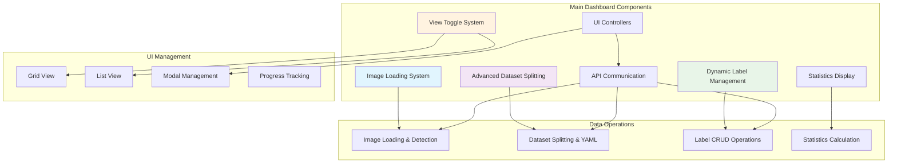
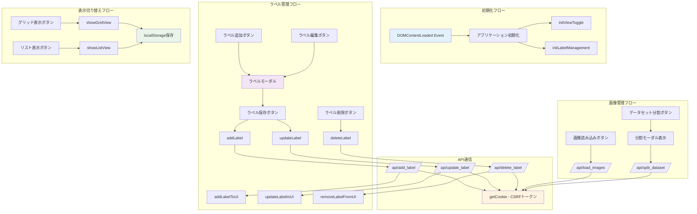

# main.js 詳細解説ドキュメント

## 概要

`main.js`は、YOLO画像アノテーターのメインページ（ダッシュボード・画像一覧）を制御するJavaScriptファイルです。画像の読み込み、高度なデータセット分割、動的ラベル管理、表示モードの切り替えなどの機能を提供します。

**注意**: アノテーション画面の前後移動やキーボードナビゲーション機能は`annotator.js`で実装されており、本ファイルではメインダッシュボードの機能を管理しています。

## アーキテクチャ概要



## 主要機能

### 1. 高度な画像管理システム
- **自動検出**: `base_images`フォルダからの画像自動検出
- **メタデータ抽出**: 画像サイズと形式の自動取得
- **進捗管理**: アノテーション完了状況の可視化
- **表示切り替え**: グリッド/リスト表示の動的切り替え

### 2. 高性能データセット分割機能
- **比率選択**: 7:3、8:2、9:1の複数比率対応
- **画像サイズ統一**: YOLO学習用サイズへの自動変換
- **YAML自動生成**: 学習用設定ファイルの作成
- **タイムスタンプ管理**: 出力フォルダの重複防止

### 3. 動的ラベル管理システム
- **リアルタイム操作**: その場でのラベル追加・編集・削除
- **使用回数表示**: 各ラベルの使用頻度追跡
- **安全な削除**: 使用中ラベルの削除防止
- **色分け管理**: 視覚的識別のための色設定

## 主要機能

### 1. アプリケーション初期化

#### DOMContentLoaded イベントハンドラー
- **目的**: ページ読み込み完了後の初期化処理
- **処理内容**:
  1. ラベルバッジの動的カラー設定
  2. ボタン要素の取得
  3. Bootstrap Modal インスタンスの作成
  4. イベントリスナーの登録
  5. 各機能モジュールの初期化

```javascript
document.addEventListener('DOMContentLoaded', function() {
    // ラベルバッジの動的カラー設定
    const labelBadges = document.querySelectorAll('.label-badge');
    labelBadges.forEach(badge => {
        const color = badge.getAttribute('data-color');
        if (color) {
            badge.style.backgroundColor = color;
        }
    });
    
    // 各種機能の初期化
    initViewToggle();
    initLabelManagement();
});
```

### 2. 画像読み込み機能

#### loadImagesBtn イベントハンドラー
- **目的**: base_imagesフォルダから画像を読み込み、データベースに登録
- **API エンドポイント**: `/api/load_images/`
- **処理フロー**:
  1. ボタンの無効化とローディング表示
  2. API通信（POST リクエスト）
  3. 成功時: アラート表示 → ページリロード
  4. 失敗時: エラーメッセージ表示
  5. 完了時: ボタン状態の復元

```javascript
loadImagesBtn.addEventListener('click', function() {
    this.disabled = true;
    this.textContent = '読み込み中...';
    
    fetch('/api/load_images/', {
        method: 'POST',
        headers: {
            'Content-Type': 'application/json',
            'X-CSRFToken': getCookie('csrftoken')
        }
    })
    // ... 処理続行
});
```

### 3. データセット分割機能

#### データセット分割モーダル表示
- **目的**: train/validationデータセットの分割比率設定UI表示
- **モーダル**: `splitModal`
- **分割比率**: ユーザー入力（デフォルト値は HTML で設定）

#### データセット分割実行
- **API エンドポイント**: `/api/split_dataset/`
- **パラメータ**: `split_ratio` (分割比率)
- **処理内容**:
  1. 分割比率の取得・検証
  2. API通信でデータセット分割実行
  3. 成功時: モーダル閉じる
  4. 失敗時: エラー表示

```javascript
confirmSplitBtn.addEventListener('click', function() {
    const splitRatio = document.getElementById('split-ratio').value;
    
    fetch('/api/split_dataset/', {
        method: 'POST',
        headers: {
            'Content-Type': 'application/json',
            'X-CSRFToken': getCookie('csrftoken')
        },
        body: JSON.stringify({
            split_ratio: parseFloat(splitRatio)
        })
    })
    // ... 処理続行
});
```

## ラベル管理機能詳細

### 関数構造

#### `initLabelManagement()`
- **目的**: ラベル管理機能の初期化
- **処理内容**:
  1. 編集状態管理変数の初期化
  2. Bootstrap Modal インスタンス作成
  3. イベントリスナーの登録
  4. イベント委譲によるボタン処理

#### ラベル操作のイベント委譲
```javascript
document.getElementById('labels-list').addEventListener('click', function(e) {
    // 編集ボタンのクリック処理
    if (e.target.closest('.edit-label-btn')) {
        // 編集モーダル表示
    }
    
    // 削除ボタンのクリック処理
    if (e.target.closest('.delete-label-btn')) {
        // 削除確認ダイアログ → API通信
    }
});
```

### CRUD 操作関数

#### `addLabel(name, color)`
- **目的**: 新規ラベルの作成
- **API エンドポイント**: `/api/add_label/`
- **パラメータ**: ラベル名、カラー
- **成功時処理**: `addLabelToUI()` でUI更新

#### `updateLabel(labelId, name, color)`
- **目的**: 既存ラベルの更新
- **API エンドポイント**: `/api/update_label/${labelId}/`
- **成功時処理**: `updateLabelInUI()` でUI更新

#### `deleteLabel(labelId)`
- **目的**: ラベルの削除
- **API エンドポイント**: `/api/delete_label/${labelId}/`
- **制限**: 使用中のラベルは削除不可
- **成功時処理**: `removeLabelFromUI()` でUI更新

## UI更新関数群

### `addLabelToUI(label)`
- **目的**: 新しいラベルをUI一覧に追加
- **生成要素**:
  - カラーインジケーター
  - ラベル名表示
  - 使用回数表示（初期値: 0）
  - 編集・削除ボタン
- **特別処理**: "ラベルがありません"メッセージの削除
- **表示スタイル**: 使用回数は薄い色（text-muted）で控えめに表示

```javascript
function addLabelToUI(label) {
    const labelsList = document.getElementById('labels-list');
    
    // "ラベルがありません"メッセージを削除
    const noLabelsMessage = document.getElementById('no-labels-message');
    if (noLabelsMessage) {
        noLabelsMessage.remove();
    }
    
    const labelItem = document.createElement('div');
    labelItem.className = 'label-item d-flex align-items-center mb-2 p-2 border rounded';
    labelItem.innerHTML = `
        <span class="color-indicator rounded-circle me-2" 
              style="width: 16px; height: 16px; background-color: ${label.color}; border: 1px solid rgba(0,0,0,0.1);"></span>
        <span class="flex-grow-1">${label.name}</span>
        <span class="text-muted me-2" style="font-size: 0.85em; opacity: 0.7;">
            (0)
        </span>
        <div class="btn-group">
            <!-- ボタン群 -->
        </div>
    `;
    // ... HTML構築
}
```

### `updateLabelInUI(label)`
- **目的**: 既存ラベルのUI表示更新
- **更新対象**:
  - カラーインジケーターの背景色
  - ラベル名テキスト
  - ボタンのdata属性
  - **注意**: 使用回数はアノテーション保存時にページがリロードされるため、この関数では更新しない

### `removeLabelFromUI(labelId)`
- **目的**: ラベルをUI一覧から削除
- **特別処理**: 全ラベル削除時の空状態メッセージ表示

## 表示切り替え機能

### `initViewToggle()`
- **目的**: グリッド表示とリスト表示の切り替え機能初期化
- **状態管理**: localStorage による表示モードの永続化
- **初期値**: 'grid' または localStorage の保存値

### 表示モード切り替え

#### グリッド表示 (`showGridView()`)
- **表示要素**: `images-grid`
- **非表示要素**: `images-list`
- **ボタン状態**: グリッドボタンをアクティブ

#### リスト表示 (`showListView()`)
- **表示要素**: `images-list`
- **非表示要素**: `images-grid`
- **ボタン状態**: リストボタンをアクティブ

```javascript
function showGridView() {
    gridViewBtn.classList.add('active');
    listViewBtn.classList.remove('active');
    imagesGrid.classList.remove('d-none');
    imagesList.classList.add('d-none');
    currentView = 'grid';
}
```

## ユーティリティ関数

### `getCookie(name)`
- **目的**: ブラウザCookieからCSRFトークンを取得
- **使用場面**: Django CSRF保護が有効なAPI通信
- **戻り値**: 指定されたCookie名の値、または null

```javascript
function getCookie(name) {
    let cookieValue = null;
    if (document.cookie && document.cookie !== '') {
        const cookies = document.cookie.split(';');
        for (let i = 0; i < cookies.length; i++) {
            const cookie = cookies[i].trim();
            if (cookie.substring(0, name.length + 1) === (name + '=')) {
                cookieValue = decodeURIComponent(cookie.substring(name.length + 1));
                break;
            }
        }
    }
    return cookieValue;
}
```

## 関数相関図



## エラーハンドリング

### API通信エラー処理
すべてのAPI通信関数で共通のエラーハンドリングパターンを採用：

```javascript
.then(response => response.json())
.then(data => {
    if (data.status === 'success') {
        // 成功時処理
    } else {
        alert('エラー: ' + data.message);
    }
})
.catch(error => {
    console.error('Error:', error);
    alert('エラーが発生しました');
})
.finally(() => {
    // 後処理（ボタン状態復元など）
});
```

### UI状態管理
- **ボタン無効化**: API通信中のダブルクリック防止
- **ローディング表示**: ユーザーフィードバック
- **状態復元**: 処理完了後の適切な状態復元

## Bootstrap Modal 管理

### モーダルインスタンス作成
```javascript
const labelModal = new bootstrap.Modal(document.getElementById('labelModal'));
const splitModal = new bootstrap.Modal(document.getElementById('splitModal'));
```

### モーダル表示・非表示
- **表示**: `modal.show()`
- **非表示**: `modal.hide()`
- **インスタンス取得**: `bootstrap.Modal.getInstance(element)`

## ローカルストレージ活用

### 表示モードの永続化
```javascript
// 保存
localStorage.setItem('imageViewMode', 'grid');

// 取得
let currentView = localStorage.getItem('imageViewMode') || 'grid';
```

## データフロー

### 画像読み込みフロー
1. ユーザーが「画像を読み込み」ボタンをクリック
2. ボタン無効化・ローディング表示
3. `/api/load_images/` へPOSTリクエスト
4. サーバーサイドでbase_imagesフォルダをスキャン
5. 成功時: ページリロードでUI更新
6. 失敗時: エラーメッセージ表示

### ラベル管理フロー
1. ラベル追加/編集ボタンクリック
2. モーダル表示・フォーム初期化
3. ユーザー入力（名前・色）
4. 保存ボタンクリック → API通信
5. 成功時: UI更新・モーダル閉じる（新規ラベルの使用回数は0で表示）
6. 失敗時: エラーメッセージ表示

### 表示切り替えフロー
1. グリッド/リスト表示ボタンクリック
2. 表示要素の切り替え（d-none クラス操作）
3. ボタンアクティブ状態の更新
4. ローカルストレージに選択状態を保存

## セキュリティ考慮事項

### CSRF保護
- Django の CSRF 保護に対応
- 全API通信でCSRFトークンをヘッダーに含める
- `getCookie('csrftoken')` でトークン取得

### XSS対策
- ユーザー入力は `.textContent` で安全に表示
- HTMLエスケープが必要な場合は適切に処理
- `innerHTML` 使用時は信頼できるデータのみ

## パフォーマンス最適化

### イベント委譲
```javascript
// 効率的なイベント処理
document.getElementById('labels-list').addEventListener('click', function(e) {
    if (e.target.closest('.edit-label-btn')) {
        // 編集処理
    }
    if (e.target.closest('.delete-label-btn')) {
        // 削除処理
    }
});
```

### UI要素の構成

### ラベル一覧の表示構造
```html
<div class="label-item d-flex align-items-center mb-2 p-2 border rounded">
    <!-- カラーインジケーター -->
    <span class="color-indicator rounded-circle me-2"></span>
    
    <!-- ラベル名 -->
    <span class="flex-grow-1">ラベル名</span>
    
    <!-- 使用回数（控えめ表示） -->
    <span class="text-muted me-2" style="font-size: 0.85em; opacity: 0.7;">
        (使用回数)
    </span>
    
    <!-- 操作ボタン群 -->
    <div class="btn-group">
        <button class="edit-label-btn">編集</button>
        <button class="delete-label-btn">削除</button>
    </div>
</div>
```

### スタイリング設計
- **使用回数の表示**: `text-muted` クラスで薄い色
- **フォントサイズ**: `0.85em` で小さめ表示
- **透明度**: `opacity: 0.7` で控えめに
- **配置**: ラベル名と操作ボタンの間に配置
