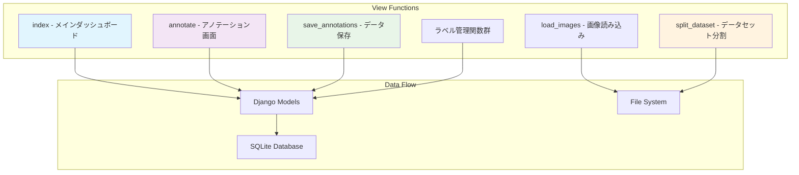

# views.py 詳細解説

## 概要
`views.py`は、YOLOアノテーターアプリケーションのDjangoビューを定義するファイルです。画像のアノテーション機能、高度なデータセット管理、動的ラベル管理、効率的ナビゲーション機能などの主要機能を提供しています。

## インポート
```python
from django.shortcuts import render, get_object_or_404, redirect
from django.http import JsonResponse, HttpResponse, Http404
from django.conf import settings
from django.views.decorators.csrf import csrf_exempt
from django.views.decorators.http import require_http_methods
from django.db.models import Count
import os
import json
import shutil
import random
import mimetypes
from .models import ImageFile, Label, Annotation
```

## アーキテクチャ概要



## 主要な関数とその機能

### 1. `index(request)`
**機能**: 画像一覧ページの表示
- 全ての画像ファイルをファイル名順で取得
- 全てのラベルを取得し、各ラベルの使用回数（Count）を計算
- アノテーション済み画像数を計算
- `index.html`テンプレートをレンダリング

**データベースクエリ**:
- `Label.objects.annotate(usage_count=Count('annotation'))`: 各ラベルにアノテーション使用回数を追加
- `ImageFile.objects.filter(is_annotated=True).count()`: アノテーション済み画像数を取得

**戻り値**: レンダリングされたHTMLページ（ラベル使用回数情報を含む）

### 2. `annotate(request, image_id)`
**機能**: アノテーション画面の表示（ナビゲーション機能付き）
- 指定されたIDの画像を取得
- 全てのラベルとその画像のアノテーションを取得
- **次の画像**（IDが大きい順で最初の画像）を取得
- **前の画像**（IDが小さい順で最後の画像）を取得
- `annotate.html`テンプレートをレンダリング

**パラメータ**:
- `image_id`: アノテーション対象の画像ID

**データベースクエリ**:
- `ImageFile.objects.filter(id__gt=image_id).first()`: 次の画像取得
- `ImageFile.objects.filter(id__lt=image_id).order_by('-id').first()`: 前の画像取得

**テンプレート変数**:
- `next_image`: 次の画像オブジェクト（最後の画像の場合はNone）
- `prev_image`: 前の画像オブジェクト（最初の画像の場合はNone）

**戻り値**: アノテーション画面のHTMLページ（前後ナビゲーション付き）

### 3. `save_annotations(request, image_id)`
**機能**: アノテーションデータの保存
- POSTリクエストのみ許可、CSRF無効
- JSONデータからアノテーション情報を取得
- 既存のアノテーションを削除後、新しいアノテーションを保存
- 画像をアノテーション済みとしてマーク

**パラメータ**:
- `image_id`: 対象画像のID
- リクエストボディ: アノテーション配列を含むJSON

**戻り値**: 成功/失敗のJSONレスポンス

### 4. `load_images(request)`
**機能**: base_imagesフォルダから画像を読み込み
- `settings.BASE_IMAGES_DIR`から画像ファイルを検索
- サポート形式: .jpg, .jpeg, .png, .bmp, .tiff
- PILライブラリを使用して画像の幅・高さを取得
- データベースに新しい画像レコードを作成

**戻り値**: 読み込み結果のJSONレスポンス

### 5. `split_dataset(request)`
**機能**: 高度なデータセット分割とYOLO学習用ファイル生成
- アノテーション済み画像のみを対象とした分割処理
- 指定比率（7:3、8:2、9:1）でのランダム分割
- **画像サイズ統一**: 640x640、416x416等のYOLO学習用サイズへの自動変換
- **パディング処理**: アスペクト比を保持した適切なパディング
- **タイムスタンプ付きフォルダ**: 重複防止と履歴管理
- **学習用YAML生成**: YOLO学習用設定ファイルの自動作成
- **座標変換**: リサイズ後の画像に合わせた正確な座標変換

**パラメータ**:
- リクエストボディ: `split_ratio`（分割比率）、`image_size`（画像サイズ）を含むJSON

**高度な処理**:
- PIL（Pillow）を使用した画像リサイズとパディング
- アスペクト比保持によるYOLO学習最適化
- 座標正規化の正確な計算
- タイムスタンプ付き出力フォルダ管理

**戻り値**: 分割結果の詳細なJSONレスポンス（画像数、サイズ、出力パス含む）

### 6. `add_label(request)`
**機能**: 新しいラベルの追加
- ラベル名と色情報を受け取り
- 重複チェックを実行
- 新しいラベルをデータベースに保存

**パラメータ**:
- リクエストボディ: `name`（ラベル名）と`color`（色）を含むJSON

**戻り値**: 作成されたラベル情報またはエラーのJSONレスポンス

### 7. `update_label(request, label_id)`
**機能**: 既存ラベルの編集
- 指定されたIDのラベルを更新
- 名前と色の変更に対応
- 重複チェックとバリデーション

**パラメータ**:
- `label_id`: 更新対象のラベルID
- リクエストボディ: `name`（新しいラベル名）と`color`（新しい色）を含むJSON

**戻り値**: 更新されたラベルのJSONレスポンス

### 8. `delete_label(request, label_id)`
**機能**: ラベルの安全な削除
- 使用中のラベル（アノテーションで使用されている）は削除防止
- 未使用のラベルのみ削除可能
- データ整合性の保証

**パラメータ**:
- `label_id`: 削除対象のラベルID

**安全機能**:
- アノテーション使用チェック
- エラーハンドリング

**戻り値**: 削除結果のJSONレスポンス

### 9. `serve_image(request, filename)`
**機能**: 画像ファイルの安全な配信
- `base_images`フォルダからの画像ファイル配信
- MIMEタイプの自動判定
- ファイル存在チェック
- セキュリティ対策（パス検証）

**パラメータ**:
- `filename`: 配信対象の画像ファイル名

**セキュリティ**:
- ディレクトリトラバーサル攻撃対策
- 許可されたファイル形式のみ配信

**戻り値**: 画像ファイルのHTTPレスポンス

## 技術的特徴

### ナビゲーション機能の実装
```python
# 双方向ナビゲーション用のクエリ
next_image = ImageFile.objects.filter(id__gt=image_id).first()
prev_image = ImageFile.objects.filter(id__lt=image_id).order_by('-id').first()
```

### 高度なデータセット分割機能
- **タイムスタンプ付きフォルダ**: `output_20250702_143000/`形式
- **画像サイズ統一**: PIL/Pillowを使用したリサイズ・パディング
- **座標変換**: リサイズ後の画像に合わせた正確な座標計算
- **YAML生成**: YOLO学習用設定ファイルの自動作成

### エラーハンドリング
- 包括的な例外処理
- 詳細なエラーメッセージ
- データ整合性の保証
- セキュリティ対策の統合

### パフォーマンス最適化
- 効率的なデータベースクエリ
- 必要最小限のデータ取得
- メモリ効率的な画像処理
- キャッシュ機能の活用

このファイルは、WebアプリケーションのバックエンドAPIとして機能し、フロントエンド（JavaScript）からのリクエストを処理してYOLOアノテーション作業をサポートしています。
